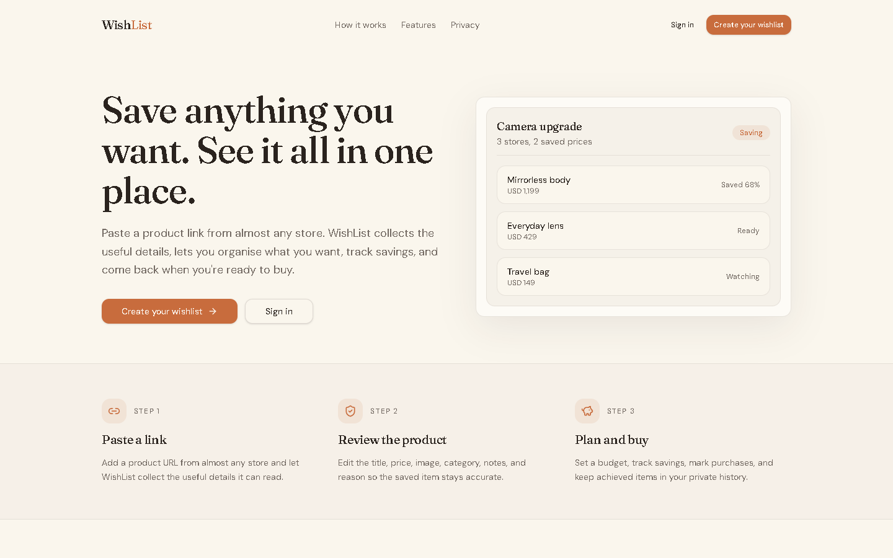

# WishList

WishList is a self-hostable, private, cross-store wishlist and purchase planning application. Save
items manually or from product URLs, organize them into categories and collections, track savings,
and keep a record of what you eventually buy.

Deploy your own copy using the [self-hosting guide](./docs/SELF_HOSTING.md).

## Preview



> The public landing page of a self-hosted WishList installation.

## What It Does

WishList gives each installation its own Supabase-backed private wishlist. You can paste product
URLs when public metadata is available, edit everything manually when extraction is incomplete, and
export your own data when you need a backup.

## Features

- Save products from different stores with editable extracted details.
- Use native-first product metadata extraction with an optional fallback.
- Preview extracted product details before saving.
- Track source URLs, canonical URLs, prices, ratings, availability, and product images.
- Organize items with categories and many-to-many collections.
- Track target budgets, amount saved, target purchase dates, and purchase reflections.
- Keep active, purchased, rejected, archived, and deleted states distinct.
- Upload or import item images into private Supabase Storage.
- Export user data as JSON backup or CSV item lists.
- Restore backups with merge or replace modes.

## Demo

A shared public demo is not linked yet. Create your own private deployment with
[docs/SELF_HOSTING.md](./docs/SELF_HOSTING.md).

## Tech Stack

- React 19 and TypeScript.
- TanStack Start, TanStack Router, and TanStack Query.
- Vite 8 with Tailwind CSS v4.
- Nitro with the Vercel preset.
- Supabase Auth, PostgreSQL, and private Storage.
- Vitest, jsdom, and React Testing Library.

## Quick Start

```bash
npm install
cp .env.example .env.local
npm run dev
```

On Windows PowerShell:

```powershell
Copy-Item .env.example .env.local
npm run dev
```

Fill `.env.local` with values from your own Supabase project before using authenticated features.
This repo does not include personal Supabase, Vercel, or Google credentials.

## Self Hosting

Start with [Self-host WishList](./docs/SELF_HOSTING.md). It covers:

- Creating your own Supabase project.
- Applying database and storage migrations.
- Configuring email/password auth.
- Optionally configuring Google OAuth.
- Deploying to Vercel.
- Running post-deploy and second-user security checks.

## Authentication

WishList uses Supabase Auth. Email/password authentication is the default path and works without
Google OAuth. Google OAuth is optional and configured through Supabase, not through browser
environment variables.

See [Google OAuth setup](./docs/GOOGLE_OAUTH_SETUP.md).

## Product Metadata Extraction

WishList currently uses:

1. Native structured metadata extraction.
2. Optional browser-backed metadata fallback where configured.
3. Image candidate ranking.
4. Remote image import into Supabase Storage when possible.

Extraction is best-effort. CAPTCHA, authentication walls, hard bot blocking, JavaScript-only
content, rate limits, protected CDNs, and missing public metadata can prevent automatic extraction.
Manual item editing remains the universal fallback.

## Data Ownership

Each installation uses its own Supabase project. Your database, auth users, storage bucket, and
environment variables are separate from every other installation.

## Security

- Browser code may use only `VITE_SUPABASE_URL` and `VITE_SUPABASE_PUBLISHABLE_KEY`.
- `SUPABASE_SECRET_KEY` is server-only and must never use a `VITE_` prefix.
- User-owned tables use Row Level Security.
- Item images live in private storage paths scoped by authenticated user ID.
- Product extraction and remote image import reject private/internal targets.
- JSON import rewrites ownership to the current signed-in user.

See [SECURITY.md](./SECURITY.md).

## Backup And Export

New JSON exports use the `wishlist-backup` format. Imports also accept the older
`aspirelist-backup` format so existing users can restore older files. CSV export includes practical
item fields for spreadsheet use.

## Development

```bash
npm run dev
npm run typecheck
npm run test
npm run lint
npm run build
npm run preview
```

## Testing

```bash
npm run typecheck
npm run test
npm run lint
npm run build
npm audit
```

Tests cover domain helpers, backup validation, item payload behavior, provider-based product
metadata extraction, fallback merge behavior, ranked product image candidates, retry behavior, and
remote image import validation.

## Deployment

Use [Vercel deployment](./docs/VERCEL_DEPLOYMENT.md). The build emits Vercel Build Output API files
under `.vercel/output`.

## Documentation

See the [documentation index](./docs/README.md).

## Contributing

See [CONTRIBUTING.md](./CONTRIBUTING.md).

## License

MIT. See [LICENSE](./LICENSE).

## Author

Yellanki Kaushik

GitHub: [https://github.com/YellankiKaushik](https://github.com/YellankiKaushik)
